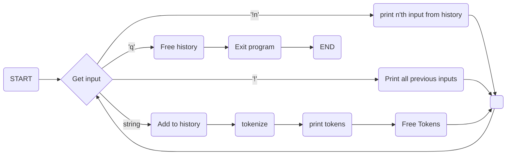

Project 1: Tokenizer
=================

### Purpose
The __main purpose__ of this project was to exercise our knowledge regarding
memory allocation and pointers in C. There were other programming facets such
as OOP and modularization excercised however these things were not the main
focus.

### Project Goals
There were 2 main goals for this project - to tokenize and keep a history of
inputs. The first main goal of this project was to implement a program that
could extract only words or __tokenize__ from a given input and show them to
the user. The second main goal of this project was to store each input so that
the user may look back later on what they previously entered or simply - view
their __history__.

### Environment
This entire project was done in Emacs in openSUSE Linux in VMware Workstation
on a Windows 10 PC. 

### State Diagram of Program


### How to Run the Program
In order to run this program, you only need to download the files shown
below. After you have downloaded the files in the same directory, it can be
ran in 2 ways in the emacs eshell (or anywhere you can run C code): using gcc
commands OR make commands. Both ways work however it is up to the you to
choose. The steps are shown below.

1 - Download the files:
- runner.c
- tokenizer.h
- tokenizer.c
- history.h
- history.c
- Makefile

RUN USING COMMANDS (in order seen):
- ```gcc -c runner.c```
- ```cc runner.o -o runner```
- ```./runner```

RUN USING Makefile (in order seen):
- ```make clean```

### Interacting with the UI
The UI is straight forward and there is a guide shown at the top once the
program is ran. A demo is shown below -

```
=========  GREETINGS USER  =========
%%%%%%%%%%%%%%%%%%%%%%%%%%%%%%%%%%%%
GUIDE TO VALID INPUTS:

-   '!n'        - prints n'th input you entered into this program (1'st input
    entered is considered 0'th for this program)
    -   '!'     - prints all inputs you entered into this program
    -   <string> - tokenizes <string>  and prints each token('<' , '>' not
    required)
    -   'q'	- Frees all memory stored in history and exits program

%%%%%%%%%%%%%%%%%%%%%%%%%%%%%%%%%%%%%

IN > !
OUT>
	*NOTHING IN HISTORY YET*
	-----------------------------------------------
	IN>  HELLO  WORLD
	OUT>
		Token 0: HELLO
		      Token 1: WORLD
		      	    >>  FREE'D TOKENS <<
			    -----------------------------------------------
			    IN> !
			    OUT>
				INPUT 0:  HELLO  WORLD
				-----------------------------------------------
				IN> h
				OUT>
					Token 0: h
					      >>  FREE'D TOKENS <<
					      -----------------------------------------------
					      IN> !1
					      OUT>
						INPUT 1: h
						-----------------------------------------------
						IN> !
						OUT>
							INPUT 0:  HELLO  WORLD
							      INPUT 1: h
							      -----------------------------------------------
							      IN> q
							      -----------------------------------------------
								>>  FREE'D
								HISTORY <<

=========  FAREWELL USER  =========
```

### Bugs
Although there may be many bugs, I tested and programmed the best I could to
handle all inputs. After
testing for a while I could only find the bug listed below. All invalid inputs
should've asked for input again if the input was invalid however I could not
figure out this bug by the deadline.
* Accessing a history element by incorrectly putting in the id correcty. For
example - '!1----' 
